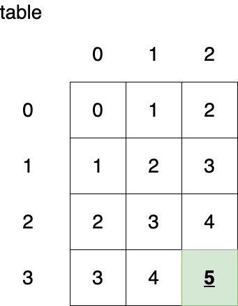

# 2D Arrays

## Learning Goals

By the end of this lesson we will be able to...

- Describe how different languages represent multi-dimensional arrays
- Explain use-cases for multi-dimenional arrays
- Traverse a Two Dimensional Array
- Use a 2-Dimensional Array to solve a coding problem

## Slides Project & Video

- [Slides](https://docs.google.com/presentation/d/13INdagN-_y6RDfMluEH4bLTneK4J1A0KwB_VYWX-9pI/edit?usp=sharing)
- [Video Lesson]()
- [Project - Hourglass Sum](https://github.com/ada-c14/2D-Arrays-Hourglass-Problem)

## Overview

We have used arrays throughout Ada.  An array is a single group of contigous elements in memory and we can access an individual element through an index.  With a bit of math the computer can find the memory location of an element in O(1) time, given the index.

  `memory_location = array_starting_memory_address + index * sizeOf(individual_element)`

However sometimes we do not need a list of elements, but rather want a table or grid.  Examples include:

- The computer screen can be depicted as a grid of pixels.
- Spreadsheets
- Product Reviews in Betsy
  - Each row is a different review
  - Each column is a different field in the review

<!-- image source 
https://drive.google.com/file/d/1thOwInrErbxrAkandK8RoXq34e0sYvwL/view?usp=sharing
-->


So we enter using Two dimensional arrays.  A 2D array is actually an array of arrays we can access individual elements with two index numbers.  A 2-Dimensional array is typically also called a _Matrix_.

The following code generates the table depicted below it.

```ruby
table = []

4.times do |row|
  table[row] = []
  3.times do |col|
    table[row][col] = row + col
  end
end
```


### Rows and Columns

Typically we visually represent a 2D array as a grid with the 1st index representing the row of a particular item and the second the column.

So for example `table[3][2]` would select the following element.



This is however a _convention_, nothing except tradition makes us visually represent a 2D array in this manner.  That said, you should always represent a 2D array in row-column format, with the 1st index representing the row number and the second representing the column number.  Otherwise you will confuse your colleagues, not to mention your instructor!

## How 2D arrays Are Represented in Memory

### In C

Some (typically lower-level languages) like **C** or **C++** represent 2D arrays internally with a 1-D array.  For example the 2D array above if generated in C would look like this internally.


This does apply only to matrices of primitives like Integers.  An array of dynamic data of objects would be stored more like Java or Ruby.  So how do _they_ store 2D arrays?

### In Ruby or Java

Languages which use references like Ruby or Java represent a 2D Array as an array of references which each element point to, or refers to, another array.  This is how Ruby would store the table above.


This means that not each subarray needs to be contiguous in memory with it's sibling arrays, and it also allows each row to be unequal (or even `nil`) in size.

## How To Make a 2D Array in Ruby

In Ruby you can create a 2D array the following ways:

```ruby
rows = 5
columns = 7
matrix = Array.new(rows) { Array.new(columns)}
```

Or

```ruby
rows = 5
columns = 7
matrix = Array.new(rows)
matrix.length.times do |row|
  matrix[row] = Array.new(columns)
end
```

The first example simply gives a more compact way to implement the second, both create a 2D array with 5 rows and 7 columns.

## Exercise Summing A 2D Array

In your editor complete the following method to sum up all the elements of the given 2D array.

```ruby
def sum_2d_array(matrix)

end


# Test code
matrix_1 = [
  [1, 2, 3],
  [4, 5, 6],
  [7, 8, 9],
]

puts "Sum of matrix 1 = #{sum_2d_array(matrix_1)}" # 45

matrix_2 = [
  [1, 1, 1],
  [1, 1, 1],
  [1, 1, 1],
]

puts "Sum of matrix 2 = #{sum_2d_array(matrix_2)}" # 9
```

<details>
  <summary>To see our solution</summary>

```ruby
def sum_2d_array(matrix)
  sum = 0
  matrix.length.times do |row|
    matrix[row].length.times do |col|
      sum += matrix[row][col]
    end
  end

  return sum
end
```
</details>

## Exercise 2 - 

## Jagged Arrays

Nothing in Ruby or other dynamically typed languages requires the number of columns in each row to be the same.  An 2D array with an inconsistent number of columns in each row is sometimes called a jagged 2D array.  You could for example do this:

```ruby
jagged_array = []

5.times do |row|
  jagged_array << []
  (row + 1).times do |i|
    jagged_array[row] << i
  end
end
```

This would result in this 2D array.


You can practice a problem involving Jagged arrays by solving [Pascal's Triangle](https://leetcode.com/explore/learn/card/array-and-string/202/introduction-to-2d-array/1170/)

## Multi-Dimensional Arrays

Arrays are not limited to 1 or two dimensions.  You can have 3, 4 or 64 dimensional arrays.  Arrays with more than 2 dimensions are not widely used in web development but the can be involved in:

- Machine Learning
- Computer Games or 3D graphics simulators
- Computing astronomical data
- Financial Data over time

Syntactically the only difference is another set of `[]` for each additional dimension of the array.

## Vocabulary

| Term      | Description | Example Code     |
| :---        |    :----:   |          ---: |
| Matrix      | A 2 dimensional array, or array of arrays.       | `list = Array.new(5) { Array.new(5) {0}` }   |
| Column   | The second index in a multi-dimensional array, indicating the element inside the nested (or inner) array.        | `list[row][column] = 25`     |
| row   | The first index in a multi-dimensional array, indicating the element inside the outer array.        | `list[row][column] = 25`     |


## Summary

In this lesson we investigated multi-dimensional arrays.

## Resources

- [Leetcode lesson (with exercises) on 2D Arrays](https://leetcode.com/explore/learn/card/array-and-string/202/introduction-to-2d-array/1166/)